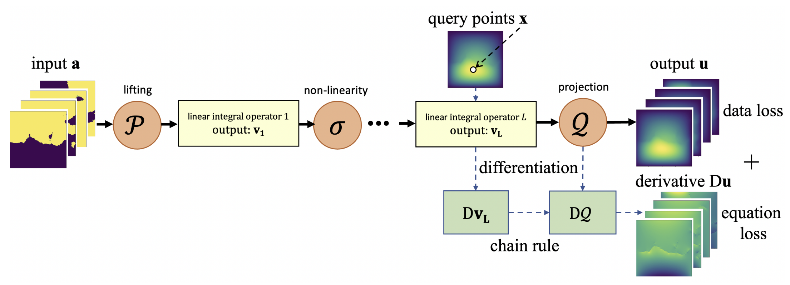
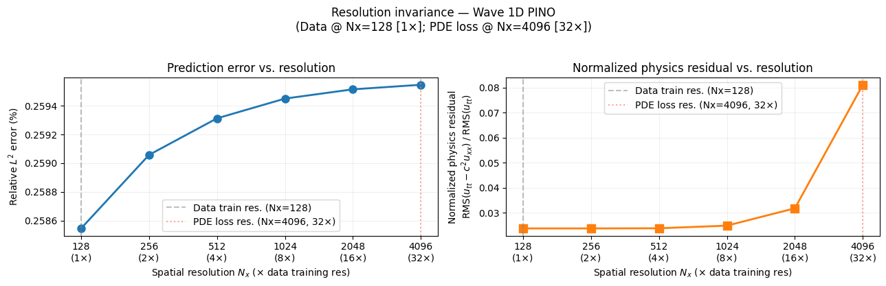
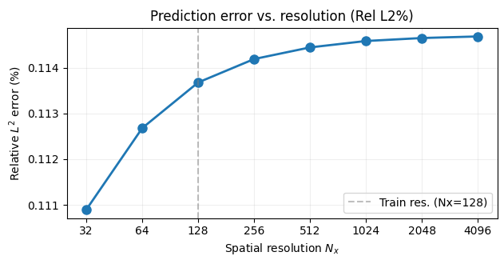
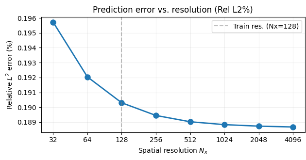
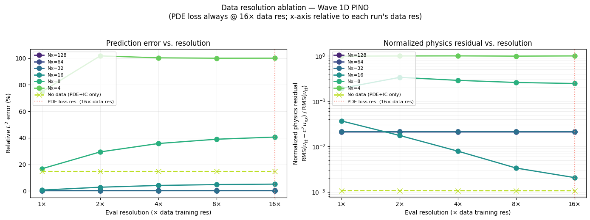
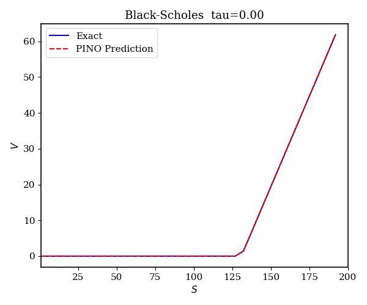
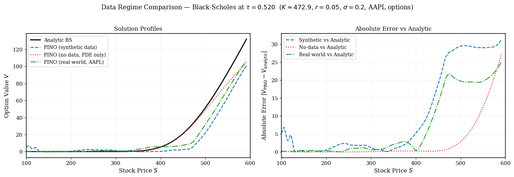

# PINO Robustness

An assessment of Physics-Informed Neural Operator (PINO) robustness under zero-shot super-resolution and noisy, real-world data regimes.

View the full [paper](CSE_481M_Paper.pdf) and 5 minute [presentation](https://youtu.be/Hz8KmMqRbpc)
 
<p align="center">
  
</p>

Created by Muhammadbager Al-Ali, Hisham Bhatti, Graham Cobden 

---

## Motivation

Physics-informed machine learning (PIML) combines data with PDE constraints to learn solutions faster and with less supervision than purely data-driven methods. Physics-Informed Neural Operators (PINOs) extend the [Fourier Neural Operator (FNO)](https://arxiv.org/abs/2010.08895) by adding a hybrid loss: data fidelity plus physics residual, initial conditions, and boundary conditions ([Li et al., 2022](https://arxiv.org/abs/2111.03794)).

Prior work shows PINOs can approximate PDE solution operators with high accuracy ([Rosofsky et al., 2023](https://arxiv.org/abs/2203.12634)). However, most evaluations do not test super resolution by training matched input-output resolutions, and assume clean, high-quality data. We stress-test two practical questions:

- Can PINO generalize to much finer grids than the training mesh (zero-shot super-resolution)? If so, how coarse can the training data be to still obtain this property?
- Does PINO still help when supervision comes from messy real-world data that only loosely follows the governing PDE?

This repo extends the [PINO Applications](https://github.com/shawnrosofsky/PINO_Applications) codebase with robustness experiments on the 1D wave equation and the Black–Scholes equation.

---

## Results

### Zero-Shot Super-Resolution (1D Wave)

**Setup:** Train with data at fixed spatial resolution (e.g. $N_x = 128$), but sample PDE loss at up to **32×** that resolution.

**Findings:**

1. Zero-shot super-resolution holds robustly up to **32×** training resolution of $N_x = 128$ when PDE loss is sampled at the target resolution

<p align="center">
  
  <br/>
  <em>Resolution invariance: data @ N<sub>x</sub>=128, PDE loss @ N<sub>x</sub>=4096 (32×).</em>
</p>

2. $L_2$ error converges as resolution increases. Convergence is **overwhelmingly monotonic** due to the peaked error landscape

<p align="center">
  
  
  <br/>
  <em>Relative L2 error vs. resolution is overwhelmingly monotone — driven by the largest peak in the squared-error landscape.</em>
</p>

3. Performance breaks down for **very coarse training data** ($N_x \leq 16$), where data and physics loss conflict rather than complement each other.

<p align="center">
  
  <br/>
  <em>Data-resolution ablation: PDE loss fixed at 16× data resolution.</em>
</p>

---

### Black–Scholes Under Ill-Defined Real-World Data

**Setup:** Apply PINO to the Black-Scholes equation for European call option pricing. Compare three training regimes with matched sample count ($N = 32$):

| Regime | Supervision |
|--------|-------------|
| **No data** | PDE + initial condition only |
| **Synthetic** | Sparse analytic Black–Scholes prices |
| **Real-world** | Filtered AAPL call options from Yahoo Finance |

**Findings:**

1. PINO with analytic data closely matches the closed-form solution across time-to-expiry ($\tau$) slices

<p align="center">
  
  <br/>
  <em>PINO prediction vs. analytic Black–Scholes at τ = 0.</em>
</p>

2. Real-world market data produces profiles **broadly comparable** to synthetic data — both outperform the no-data baseline on shape

<p align="center">
  
  <br/>
  <em>Solution profiles and absolute error vs. analytic BS at τ ≈ 0.52 (AAPL options).</em>
</p>

Sparse, masked supervision is viable, but whether rough empirical data can reliably substitute for high-fidelity labels remains an open question.

---

## Conclusion

PINO's physics loss is remarkably robust: zero-shot super-resolution works up to large scale factors when training data is not too coarse, and physics-only training can anchor solutions even without output labels. However, data still matters! It anchors the solution profile that physics alone cannot fully recover but low-fidelity, real-world supervision can be nearly as useful as clean synthetic data in our Black–Scholes experiments.

These results support using PINO in low-data, non-ideal regimes common in engineering and social-science domains where measurements are sparse, noisy, or only loosely satisfy the PDE.

---

## How to Run

```bash
python -m venv .venv
source .venv/bin/activate   # Windows: .venv\Scripts\activate
pip install -r requirements.txt
jupyter notebook
```

Main experiment notebooks:

| Notebook | Description |
|----------|-------------|
| [`Wave1D_PINO.ipynb`](Wave1D_PINO.ipynb) | Super-resolution sweeps, ablations, convergence analysis |
| [`BlackScholes_PINO.ipynb`](BlackScholes_PINO.ipynb) | Analytic BS training + three-way data-regime comparison |
| [`real_data_validation.py`](real_data_validation.py) | AAPL options fetch, filtering, sparse masked training |

> **Note:** Black–Scholes real-data experiments require `yfinance` (install separately if needed). GPU recommended but not required for smaller sweeps.

---

## Acknowledgments

*Completed as part of CSE 481M (Machine Learning Capstone) at the University of Washington, Spring 2026.*  
Thanks to Prof. Pang Wei Koh, Zhiyuan Zeng, and Rulin Shao for their guidance.

This project builds on [PINO Applications](https://github.com/shawnrosofsky/PINO_Applications) (Rosofsky, Al Majed & Huerta, 2023).
